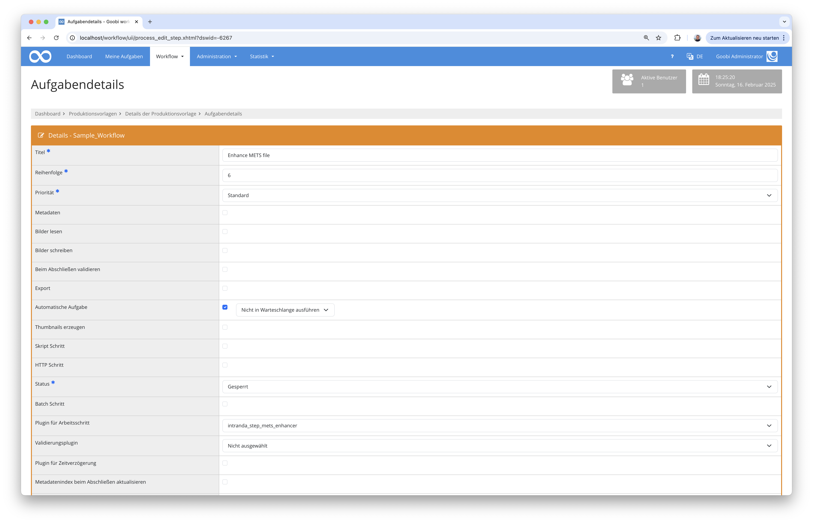
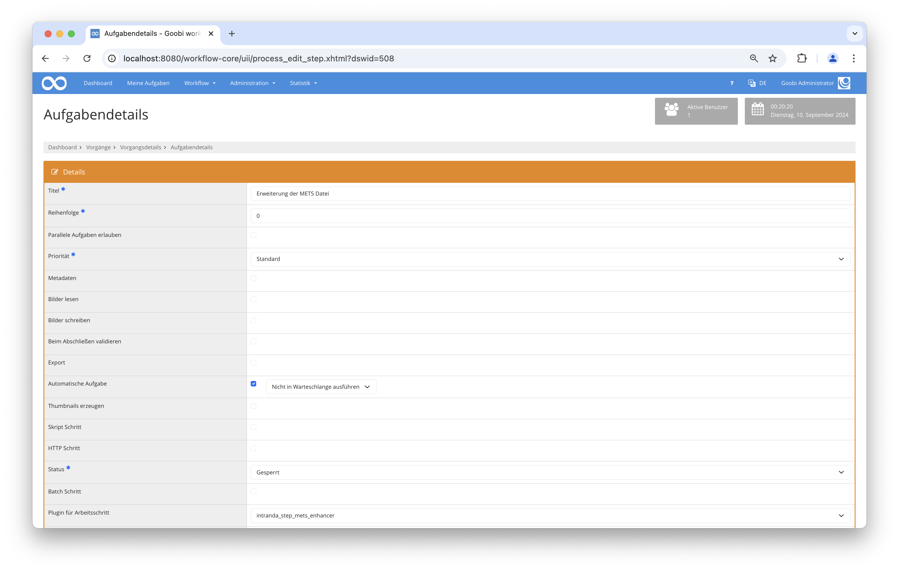

## Einführung
Diese Dokumentation erläutert das Step Plugin für Goobi workflow zur automatischen Anreicherung von METS-Dateien mit den zugehörigen Mediendateien. Je nach Konfiguration können hierbei ebenfalls automatisch eine Paginierung erzeugt sowie weitere Metadaten hinzugefügt werden.

## Installation
Um das Plugin nutzen zu können, müssen folgende Dateien installiert werden:

```bash
/opt/digiverso/goobi/plugins/plugin-step-mets-enhancer-base.jar
/opt/digiverso/goobi/config/plugin-step-mets-enhancer-base.xml
```

Nach der Installation des Plugins kann dieses innerhalb des Workflows für die jeweiligen Arbeitsschritte ausgewählt und somit automatisch ausgeführt werden.

Für die Verwendung des Plugins muss dieses in einem Arbeitsschritt wie folgt ausgewählt sein:




## Überblick und Funktionsweise
Das Plugin wird üblicherweise eingesetzt, wenn innerhalb des Workflows nicht beabsichtigt ist, manuell mit an der METS-Datei zu arbeiten und diese automatisch zu veröffentlichen. In diesem Fall könnte ein Workflow beispielsweise wie folgt aussehen:



Hier wird also die METS-Datei von dem Plugin automatisch geöffnet und wie konfiguriert angereichert. Dabei werden zunächst einmal sämtliche Mediendateien aus dem Dateisystem des Vorgangs neu zu dem obersten Strukturelement zugewiesen. Auf Wunsch kann dabei je nach Konfiguration ebenso auch eine Paginierung verschiedenen Typs erzeugt werden. Zudem lassen sich über die Konfiguration ebenso automatisch weitere Metadaten für das oberste Strukturelement ergänzen.

## Konfiguration
Die Konfiguration des Plugins erfolgt in der Datei `plugin_intranda_step_mets_enhancer.xml` wie hier aufgezeigt:

{{CONFIG_CONTENT}}

{{CONFIG_DESCRIPTION_PROJECT_STEP}}

Parameter               | Erläuterung
------------------------|------------------------------------
| `<createPagination>`   | Hier kann mit dem Wert `true` festgelegt werden, ob autoamtisch eine Paginierung erstellt werden soll. Diese kann zusätzlich durch das Attribut `type` festgelegt werden. Für die Paginierung stehen die folgenden Typen zur Verfügung: `uncounted`, `roman`, `ROMAN` oder `arabic` |
| `<addMetadata>`        | Hier können weitere Metadaten in die Konfiguration festgelegt werden, die dem obersten Strukturelement zugefügt werden sollen. Das Attribut `type` definiert hierbei den gewünschten Metadatentyp, wie er im Regelsatz zur Verfügung steht, und mittels des Attributs `value` wird der zu verwendende Wert festgelegt. Dieses Element ist wiederholbar.|