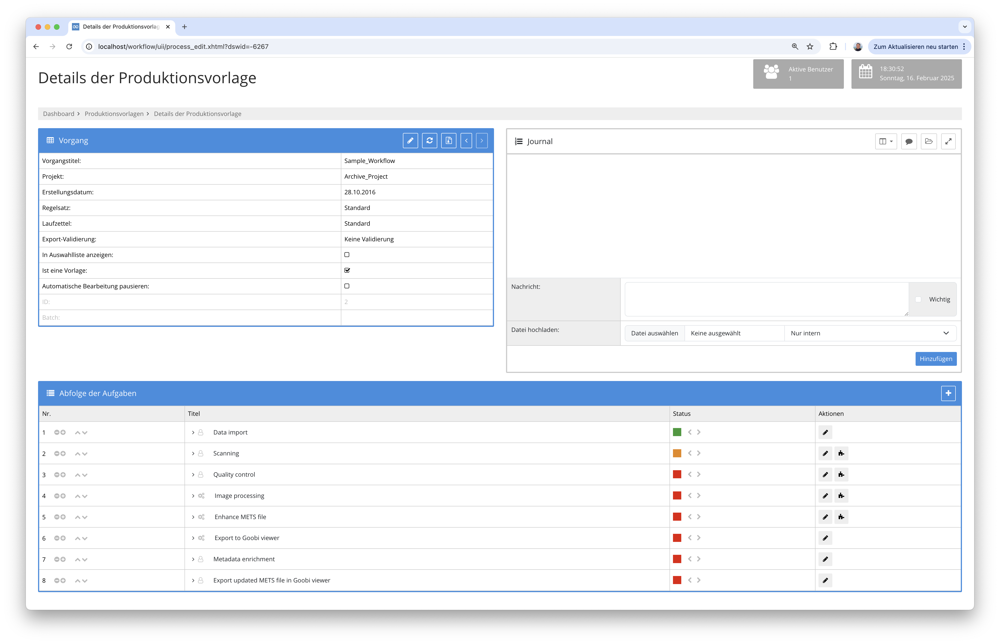

## Einführung
Diese Dokumentation erläutert das automatische Anreichern von Daten in der METS-Datei mit konfigurierbarer Paginierung.

## Installation
Um das Plugin nutzen zu können, müssen folgende Dateien installiert werden:

```bash
/opt/digiverso/goobi/plugins/plugin-step-mets-enhancer-base-24.03-SNAPSHOT.jar
/opt/digiverso/goobi/config/plugin_intranda_step_mets_enhancer.xml
```

Nach der Installation des Plugins kann dieses innerhalb des Workflows für die jeweiligen Arbeitsschritte ausgewählt und somit automatisch ausgeführt werden.

Für die Verwendung des Plugins muss dieses in einem Arbeitsschritt ausgewählt sein:




## Überblick und Funktionsweise
Das Plugin öffnet die METS-Datei und reichert diese um die Metadaten der im Media-Ordner enthaltenen Bilder an. Zudem lässt sich eine `collection` automatisch hinzufügen, wenn noch keine in der METS-Datei definiert wurde. Außerdem können eine Paginierung und weitere Metadaten durch Konfiguration hinzugefügt werden.

## Konfiguration
Die Konfiguration des Plugins erfolgt in der Datei `plugin_intranda_step_mets_enhancer.xml` wie hier aufgezeigt:

{{CONFIG_CONTENT}}

{{CONFIG_DESCRIPTION_PROJECT_STEP}}

Parameter               | Erläuterung
------------------------|------------------------------------
| `<createPagination>`   | Hier kann durch den Wert `true` eine Paginierung erstellt werden. Diese kann zusätzlich durch den `type` konfiguriert werden. Die Paginierung kann `uncounted`, `roman`, `ROMAN` oder `arabic` sein. |
| `<collection>`         | Hier kann der Wert angegeben werden, der als `collection` in der METS-Datei eingetragen werden soll, falls noch keiner existiert. |
| `<addMetadata>`        | Hier können weitere Werte in die Konfiguration eingetragen werden. Der `type` muss einem bekannten Metadatentyp entsprechen, und `value` kann beliebig gesetzt werden. |
