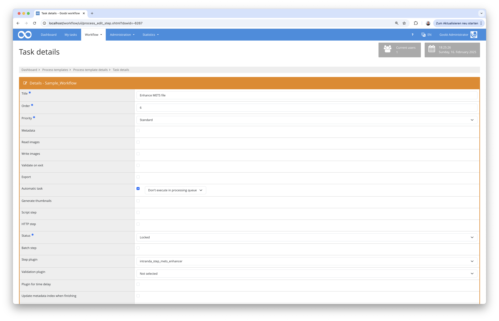
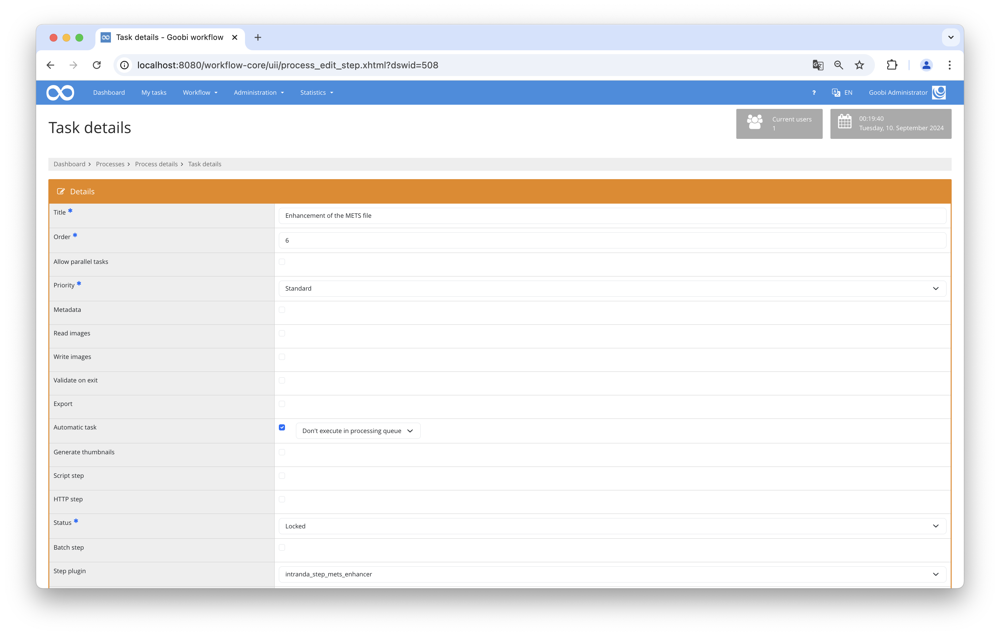

## Introduction
This documentation explains the Step plugin for Goobi workflow for the automatic enrichment of METS files with the associated media files. Depending on the configuration, pagination can also be generated automatically and additional metadata added.

## Installation
To use the plugin, the following files must be installed:

```bash
/opt/digiverso/goobi/plugins/plugin-step-mets-enhancer-base.jar
/opt/digiverso/goobi/config/plugin-step-mets-enhancer-base.xml
```

Once the plugin has been installed, it can be selected within the workflow for the respective workflow steps and thus executed automatically.

To use the plugin, it must be selected in a workflow step as follows:




## Overview and functionality
The plugin is usually used if it is not intended to work manually on the METS file within the workflow and to publish it automatically. In this case, a workflow could look like this, for example:



In this case, the METS file is automatically opened by the plugin and enriched as configured. Firstly, all media files from the file system of the process are reassigned to the topmost structural element. Depending on the configuration, different types of pagination can also be created if required. The configuration can also be used to automatically add further metadata for the top-level structure element.

## Configuration
The plugin is configured in the file `plugin_intranda_step_mets_enhancer.xml` as shown here:

{{CONFIG_CONTENT}}

{{CONFIG_DESCRIPTION_PROJECT_STEP}}

Parameter               | Explanation
------------------------|------------------------------------
| `<createPagination>`   | The value ‘true’ can be used here to specify whether pagination should be created automatically. This can also be defined using the ‘type’ attribute. The following types are available for pagination: `uncounted`, `roman`, `ROMAN` or `arabic` |
| `<addMetadata>`        | Further metadata to be added to the top-level structural element can be defined in the configuration here. The `type` attribute defines the desired metadata type as it is available in the rule set, and the `value` attribute is used to specify the value to be used. |